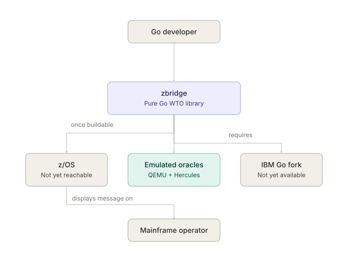
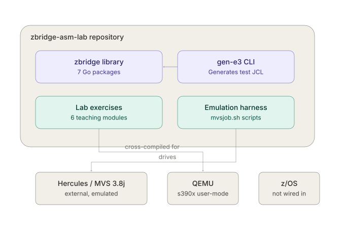
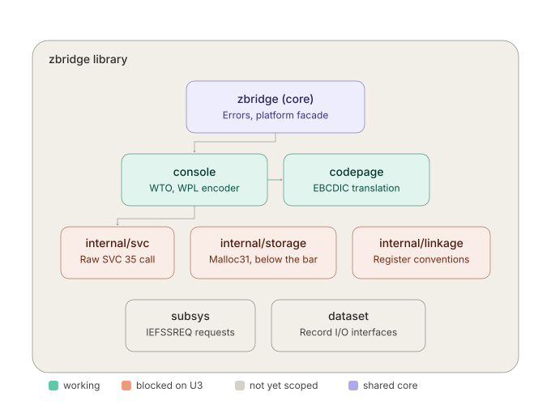
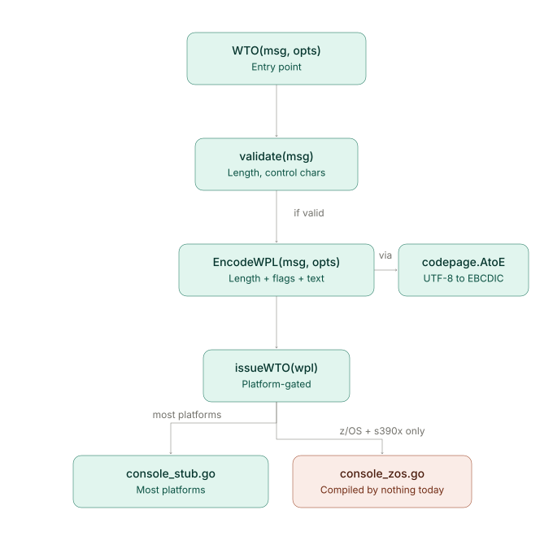

# The C4 model, all four levels

**Read [`../README.md`](../README.md) first** if you haven't. This document assumes you
already know what zbridge is, what WTO/`SVC 35` mean, and what U1/U2/U3 are.

## What C4 is, for readers meeting it for the first time

The [C4 model](https://c4model.com) is a way of drawing software architecture at four
different zoom levels, each answering a different question, each assuming you've
already seen the level above it:

| Level | Question it answers | Zoom |
|---|---|---|
| 1. System Context | What is this system, and what does it talk to? | Furthest out — no code visible at all |
| 2. Container | What are the separately built/run pieces inside it? | One step in |
| 3. Component | What are the pieces *inside one of those* pieces? | One step further |
| 4. Code | How does one component actually work, call by call? | Closest — this is where actual functions appear |

**These four levels answer "what are the pieces and how are they organized."** They
deliberately don't answer "what happens in what order," "what state can the system be
in," or "what do real values actually look like for one real run" — those are
different questions, with different diagram types, covered in
**[`sequence-state-object-diagrams.md`](sequence-state-object-diagrams.md)**: a
sequence diagram of the live demo across all five systems it touches, a state diagram
of every condition the emulated mainframe can be in (including the one that loses
work if you skip it), and an object diagram with the actual byte values from one real,
captured run. If you're preparing to present this project, read that document too —
it's written at the same zero-assumed-mainframe-knowledge level as this one.

The name comes from "**C**ontext, **C**ontainer, **C**omponent, **C**ode" — four C's.
Each level is a legitimate stopping point. A reader who only wants the big picture
stops at Level 1; a reader about to modify `console/wpl.go` needs Level 4.

**A note on vocabulary before you look at Level 2:** C4's "container" does **not** mean
Docker. It means any separately buildable, runnable, or deployable unit — in this
project that's things like "the `zbridge` Go module" or "a shell script harness," not
literal containers. This is the single most common point of confusion for readers who
already know Docker.

---

## Level 1 · System Context

**What this shows:** zbridge from the outside, as a black box, with everything it talks
to or depends on. No code is visible at this level — if you can't see any function
names, you're at the right zoom.

**How to read it:** a Go developer writes code that calls `WTO()`, which zbridge
provides. Three things sit around zbridge, and the diagram is honest about which of
them exist *today*: the emulated test oracles (QEMU and Hercules — colored, because
they're real and usable right now) are how the library is actually validated during
development; z/OS, the eventual production target, and IBM's Go toolchain fork, the
thing that would ever let this code *build* for z/OS, are both drawn in neutral gray
because **neither is reachable yet**. Once (if) z/OS is reached, it would display the
resulting message to a mainframe operator — that's the whole point of the exercise.

**Why the coloring matters here:** it would be easy to draw all three external boxes
the same way and imply they're equally available. They're not, and the color is doing
real work — see [`README.md`](../README.md) §5 for the U1/U2/U3 framework this maps
onto directly: QEMU and Hercules retired U1 and U2; z/OS and the Go fork are U3, and
U3 is open.

---

## Level 2 · Container

**What this shows:** one step inside the zbridge-asm-lab repository — the separately
buildable pieces that live inside it, and what each one actually talks to today.

**How to read it:** four containers exist. The **zbridge library** is the production
code; the **gen-e3 CLI** is a small command that imports it (specifically,
`console.EncodeWPL` and `console.FormatDC` — see
[`evidence-ladder.md`](../evidence-ladder.md) §5) to generate a ready-to-submit MVS
test job. Separately, the **lab exercises** — six small teaching modules at the repo
root — are cross-compiled and run under **QEMU**, and the **emulation harness**
(`docs/runbooks/mvsjob.sh` and its supporting scripts) drives **Hercules running MVS
3.8j**. Notice what's *not* connected to anything: **z/OS sits at the bottom with no
arrow pointing at it.** That's not a drawing omission — it's accurate. Nothing in this
repository is wired up to z/OS yet, and the empty connection says that more honestly
than a dashed "future" arrow would.

**A relationship worth noticing:** the zbridge library and the lab exercises are drawn
as **separate containers with no arrow between them at all**. That's deliberate and
matches a hard rule of this repository — see
[`zbridge-module.md`](../zbridge-module.md) §1: every lab module has its own `go.mod`,
and `zbridge/` never imports lab code or vice versa. The lab *taught* the technique
(hand-encoding instructions Go's assembler has no mnemonic for); it did not become a
dependency.

---

## Level 3 · Component

**What this shows:** one step further inside — the zbridge library container from
Level 2, opened up to show its eight Go packages.

**How to read it:** color here encodes **status**, not just category, and the legend at
the bottom names all four. Teal packages (`console`, `codepage`, and the shared
`zbridge` core) work and are tested today. Coral packages (`internal/svc`,
`internal/storage`, `internal/linkage`) are blocked on **U3** specifically — they're
fully designed, but their bodies need real z/OS behavior no emulator provides (see
[`emulation-harnesses.md`](../emulation-harnesses.md) §6). Gray packages (`subsys`,
`dataset`) are blocked for a *different* reason: nobody has scoped their operations yet
— that's an owner decision waiting on a closer reading of `ibmruntimes/go-recordio`,
not a technical blocker. Conflating those two kinds of "not done yet" would be
misleading, which is exactly why they're different colors here rather than one
generic "todo" shade.

**Only two relationships are drawn**, deliberately, out of many real ones: `console`
depends on `codepage` for EBCDIC translation (a real, working call), and `console`
depends on `internal/svc` for the eventual raw `SVC 35` call (a real but *not-yet-live*
dependency — `internal/svc.Call35` has no assembly body yet). Every package in this
diagram also imports the shared `zbridge` core for its error type; that fact is
represented by one arrow from the core to `console`, standing in for all seven, rather
than drawn eight times. Full detail on every package: **[`zbridge-module.md`](../zbridge-module.md)**.

---

## Level 4 · Code

**What this shows:** the closest zoom — inside the `console` component from Level 3,
tracing exactly what happens, function by function, when someone calls `WTO(msg,
opts...)`. This is the only level where actual function names and real control flow
appear.

**How to read it:** the flow runs top to bottom through code that's real and tested
today (all in teal): `WTO` validates its input, then calls `EncodeWPL` to build the WTO
Parameter List — which itself calls `codepage.AtoE` to translate the message to EBCDIC
along the way (see [`wpl-svc35-mechanism.md`](../wpl-svc35-mechanism.md) for exactly
what those bytes look like). The result reaches `issueWTO`, and here the diagram
branches, because Go compiles a **different file** depending on the build target (see
[`zbridge-module.md`](../zbridge-module.md) §3.3): on every platform except z/OS-on-s390x,
`console_stub.go` runs and returns a typed error. On z/OS-on-s390x, `console_zos.go`
would call `internal/svc.Call35` — except that branch is colored coral and its subtitle
says exactly why: **that file is compiled by nothing today**, because no Go toolchain
can currently target z/OS at all.

**The honest thing this diagram is doing:** a less careful version of this diagram
might draw both branches the same way and let a reader assume both are equally live
code paths. They're not — one runs on every `go test` in this repository, and the
other has never been compiled by anything, ever. The color is the diagram's way of not
overstating what exists.

---

## How these four levels relate to the rest of this folder

Level 3's package boundaries are exactly [`zbridge-module.md`](../zbridge-module.md)'s
subject. Level 4's call chain is the shape of
[`wpl-svc35-mechanism.md`](../wpl-svc35-mechanism.md), minus the byte-level detail —
this diagram shows *that* `EncodeWPL` is called; that document shows *what it produces*
and *why*. Level 1's U1/U2/U3-shaped external systems are the subject of
[`evidence-ladder.md`](../evidence-ladder.md) (how U1 and U2 got retired) and
[`emulation-harnesses.md`](../emulation-harnesses.md) (what the two emulated oracles
in Level 1 and Level 2 actually are). If a diagram here raises a question, one of those
four documents almost certainly answers it in prose.
