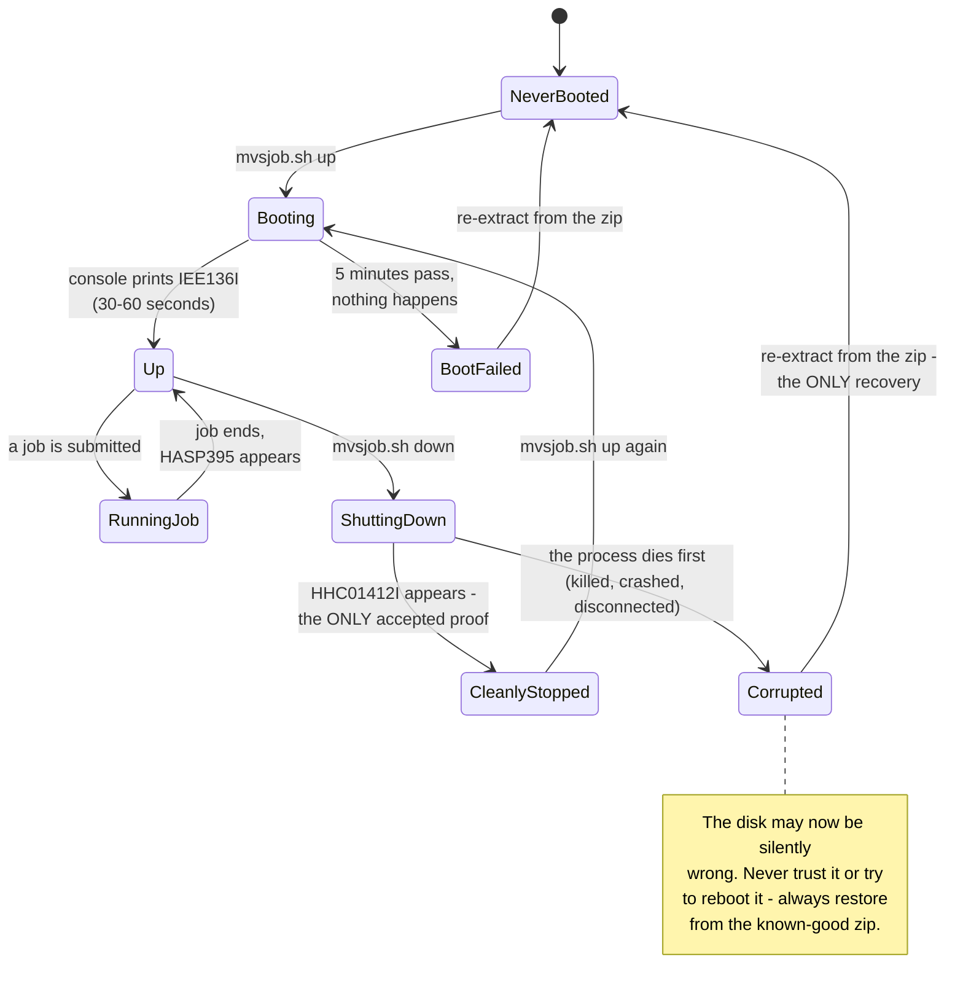
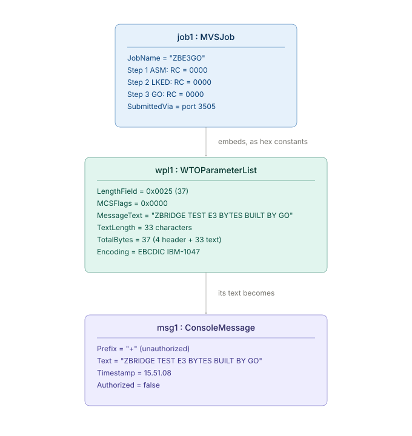

# Beyond C4: sequence, state, and object diagrams

**Who this document is for:** someone who already knows what a sequence diagram, a
state diagram, and an object diagram *are* in general (this assumes general software
engineering background), but has **zero prior exposure to mainframe or IBM-specific
concepts** — no macros, no JCL, no assumed familiarity with any of this domain's
jargon. Every term is defined the first time it's used. If you're presenting this
material to someone else, treat this document as the script, not just the reference.

**Why this document exists alongside `c4/README.md`:** the four C4 diagrams
(Context/Container/Component/Code) answer *"what are the pieces and how are they
organized."* They deliberately do not answer three other questions that matter just as
much for actually understanding and presenting this project:

1. **What happens, in what order, when the demo runs?** → the **sequence diagram** (§1)
2. **What states can the mainframe actually be in, and what causes it to move between
   them?** → the **state diagram** (§2)
3. **What do the actual bytes and values look like for one real, specific run — not
   the abstract shape, but real numbers?** → the **object diagram** (§3)

Read [`README.md`](../README.md) first if you haven't. Everything below assumes you
already know what WTO, `SVC 35`, and the WPL are, at least at the level that document
explains them.

---

## 1. The sequence diagram — what happens, in order, across five different systems

### 1.1 What a sequence diagram is doing here, specifically

A sequence diagram shows **time flowing downward** and **participants as vertical
lines** ("lifelines"). Every arrow is one message, in the exact order it happens. The
reason this project needs one, specifically: **the demo crosses five genuinely
different systems** — your laptop, a small script, a 1981-era job scheduler, a single
CPU instruction, and a physical-feeling console screen — and a reader who has never
seen a mainframe has no intuition for which of those five things is doing what at any
given moment. The sequence diagram is the antidote to that confusion: it is the literal
timeline of the demo in [`RUN.md`](../../../RUN.md) §6, drawn.

```mermaid
sequenceDiagram
    actor You
    participant Go as Go code<br/>gen-e3 (your laptop)
    participant Harness as mvsjob.sh<br/>the demo script
    participant JES2 as MVS / JES2<br/>the mainframe job queue
    participant SVC as SVC 35<br/>Write To Operator
    participant Console as Operator console

    You->>Go: go run ./cmd/gen-e3 "message"
    activate Go
    Go->>Go: EncodeWPL builds the exact bytes
    Go-->>You: prints a ready-to-run job file (zbe3go.jcl)
    deactivate Go

    You->>Harness: mvsjob.sh run zbe3go.jcl
    activate Harness
    Harness->>JES2: submits the job over a network socket
    activate JES2
    JES2->>JES2: assembles the program
    JES2->>JES2: links it into an executable
    JES2->>SVC: runs it; it executes the SVC 35 instruction
    activate SVC
    SVC->>Console: displays the message
    deactivate SVC
    JES2-->>Harness: job ended, every return code is 0000
    deactivate JES2
    Harness-->>You: prints the console line and confirms success
    deactivate Harness
```

### 1.2 Every participant, explained from zero

Read this section before you present — it's the vocabulary that makes the diagram
above make sense out loud.

- **You.** The person typing commands. In the demo, you say what message to send.
- **Go code (`gen-e3`).** An ordinary Go program, running on your ordinary laptop. It
  does exactly one job: turn a plain text message into the exact sequence of bytes a
  mainframe service expects, and write out a small text file containing a mainframe
  program. **Nothing mainframe-specific runs here — this step is 100% portable Go.**
- **`mvsjob.sh` ("the harness").** A small shell script this project wrote. It's the
  remote control: it sends your file to the mainframe, waits, and reports back what
  happened. You never interact with the mainframe directly — this script does it for
  you, which is what makes the demo repeatable instead of a manual, click-through
  process.
- **MVS / JES2 ("the mainframe job queue").** **MVS** is the name of the operating
  system running on the emulated mainframe (a 1981 ancestor of IBM's modern z/OS — see
  [`README.md`](../README.md) §2.1 for why an old system is a legitimate stand-in).
  **JES2** ("Job Entry Subsystem 2") is the part of MVS that receives work, runs it in
  order, and hands back the results — think of it as a task queue and a task runner
  combined. Nothing you submit runs *immediately* on the CPU; it first goes into
  JES2's queue, exactly like a print queue or a batch job scheduler. Two things happen
  inside this one lifeline, back to back:
  - **Assembling.** Your submitted file contains program source code written in
    **mainframe assembly language** — the lowest-level, most literal way to write a
    program for this machine (every line is close to one CPU instruction). "Assembling"
    means translating that human-readable source into the raw bytes the CPU actually
    executes. The assembler used here is called **IFOX00**.
  - **Linking.** Turning the assembled pieces into one runnable program. The linker
    used here is called **IEWL**.
- **`SVC 35` ("Write To Operator," or "WTO").** This is not a program — it's a single
  CPU **instruction**, one of the most fundamental things this computer can do.
  "SVC" stands for **Supervisor Call**: a program can't directly do privileged things
  like writing to the console, so instead it executes this instruction, which hands
  control to the operating system and says "please do privileged thing number 35 for
  me." Number 35 happens to mean "put this text on the console." This is the single
  instruction the entire project exists to reach — see
  [`README.md`](../README.md) §2.3.
- **Operator console.** The screen a human operator watches to know what a running
  mainframe is doing — see [`README.md`](../README.md) §2.2. In this project's
  automated demo, nobody is actually watching it in real time; instead, everything it
  displays is captured to a log file, which is how the harness can show you the result
  afterward without a human needing to be staring at a screen.

### 1.3 What to say out loud at each step (a presenter's script)

1. *"I write the message I want to send, in plain English, and run one Go command."*
2. *"That Go program — completely ordinary, portable Go, nothing special — builds the
   exact bytes the mainframe service expects, and writes out a small mainframe program
   containing them."* This is the whole point: **the hard, mainframe-specific part was
   done by Go, before the mainframe was ever involved.**
3. *"A script submits that file to the mainframe over the network — no terminal, no
   manual typing on the mainframe side."*
4. *"The mainframe assembles it, links it, and runs it. Running it means executing one
   instruction: `SVC 35`, Write To Operator."*
5. *"That instruction reads the bytes Go built, and the operator console displays the
   message."*
6. *"The whole round trip reports back success — three return codes, all zero."*

That's the entire thesis result, end to end, in six sentences.

---

## 2. The state diagram — every state the mainframe can be in, and why the rules exist

### 2.1 Why this diagram exists

**Because the emulated mainframe is not always safely usable, and the difference
matters enormously — this project genuinely lost work to it three times before the
rules below were written down** (see `docs/evidence/E0-tk5-boot-2026-07-26.md`,
"Operational lessons"). A state diagram shows every condition ("state") the system can
be in and every event that moves it from one to another. If you're the one running the
demo, this diagram is your safety instructions.



### 2.2 Every state, explained, plus the vocabulary you need

- **NeverBooted.** The mainframe's virtual hard disk exists as a file on your computer,
  freshly unpacked from a downloaded archive, and has never been started. This is the
  only state that is *provably* safe — a disk that has never run can't have been
  corrupted by a bad shutdown.
- **Booting ("IPL").** The mainframe operating system is starting up. The mainframe
  term for "boot" is **IPL** — **Initial Program Load**. During IPL, the system prints
  a stream of status messages; a specific one, `IEE136I`, is this project's signal that
  startup finished successfully and the system is ready for work.
- **Up.** The system is idle and ready to accept jobs. This is the state you want to
  be in right before a live demo.
- **RunningJob.** A submitted program is actively assembling, linking, or executing.
  This is a brief, transient state — seconds, not minutes.
- **ShuttingDown.** A shutdown has been requested and the system is in the middle of
  safely writing everything to disk before stopping.
- **CleanlyStopped.** Shutdown finished correctly. **The single message
  `HHC01412I Hercules terminated`** is the *only* thing this project accepts as proof
  of this — not "the window closed," not "the process isn't running anymore." The
  reason for that strictness: a process can stop running for many reasons, and only one
  of them (this exact message appearing) means the disk was left in a trustworthy
  state.
- **Corrupted.** Something stopped the system *before* it finished its own shutdown
  sequence — the terminal was closed, the process was killed, the connection dropped.
  **The disk file may now contain a write that was only half-completed.** This state is
  dangerous specifically because it doesn't necessarily *look* broken — the system
  might even boot again and seem to work, while quietly holding bad data. That is
  exactly why the rule is "always re-extract from the known-good download," never "try
  it and see."
- **BootFailed.** Startup didn't complete in the expected time. In practice this
  usually means the system was already running from a previous session (see the
  troubleshooting table in [`RUN.md`](../../../RUN.md) §8) — not a mainframe problem.

### 2.3 The one rule to internalize before presenting live

**If you need to stop the demo mid-session for any reason, always run the shutdown
command and wait for it to confirm — never just close the terminal.** The diagram's
entire "Corrupted" branch, and the three real incidents that motivated documenting it,
all trace back to skipping this. If a shutdown ever fails to confirm, the fix is not to
force it — it's to leave it alone, re-extract a fresh copy from the verified download
(§4 of `RUN.md`), and treat the abandoned copy as untrustworthy going forward.

---

## 3. The object diagram — one real run, with real numbers, frozen in place

### 3.1 What an object diagram shows, and why it's different from everything else in this repo

Every other diagram in this project describes the *general shape* of things — "a
parameter list has a length field, then flags, then text," true for *any* message.
**An object diagram shows one specific instance, with its actual, real values filled
in** — not "a length field," but "the length field, which in this run was exactly the
number 37." This is the diagram to point at when someone asks "OK, but what does this
actually look like, for real, once?"

Every value below is real — copied from an actual run captured in
`docs/evidence/E1-E3-wto-layout-and-svc35-2026-07-26.md`, not invented for
illustration.



### 3.2 Reading UML object notation, and what each object means here

The header of each box reads `instanceName : ClassName` — for example
`wpl1 : WTOParameterList` means *"here is one specific parameter list, and I'm calling
it `wpl1` so I can refer to it."* Below the header, every line is one field and its
actual value for this specific instance.

- **`job1 : MVSJob`.** The actual mainframe program that got submitted, named
  `ZBE3GO` (mainframe job names are short, historically limited to 8 characters). It
  ran in three steps — assemble, link, run — and every single one reported back
  **return code 0000**, which on this system is the universal signal for "no problem
  occurred." Three zeroes in a row is what "it worked" looks like on a mainframe job
  listing.
- **`wpl1 : WTOParameterList`.** The actual bytes built by Go for this run — see
  [`wpl-svc35-mechanism.md`](../wpl-svc35-mechanism.md) for what every one of these
  fields means and how its layout was discovered. For this specific 33-character
  message, the length field is **37** (33 characters of text, plus 4 bytes of header —
  see that document §3.3 for why it's always exactly `+4`), the flags are all zero
  (the simplest possible form of the message), and the text itself is stored in
  **EBCDIC**, the mainframe's native character encoding, not the ASCII/UTF-8 this
  document is written in.
- **`msg1 : ConsoleMessage`.** What actually appeared on the operator's screen. The
  leading `+` is not a typo or a formatting artifact — MVS puts that character in front
  of any console message coming from a program that isn't specially authorized to skip
  it. It's a visible, honest signal of *"an ordinary program sent this, not the
  operating system itself,"* and it's how you can tell, just by looking at the console
  output, exactly what this project's WTO call actually is: an ordinary, unprivileged
  program successfully talking to the operator.

**The two arrows tell the causal story:** `job1` **embeds** `wpl1` — literally, `wpl1`'s
bytes are written directly into `job1`'s source code as hexadecimal constants (see
[`wpl-svc35-mechanism.md`](../wpl-svc35-mechanism.md) §3.6 for exactly what that source
code looks like) — and running `job1` is what causes `wpl1`'s text to become `msg1`,
appearing on the console. Nothing here is inferred or reconstructed after the fact:
this is the literal, three-step story of one specific message travelling from a Go
program's memory to a screen.

---

## Where this fits

These three diagrams, together with [`c4/README.md`](README.md)'s four levels, are the
complete visual explanation of this project. If you're presenting and someone asks a
question this document doesn't answer, the prose documents in
[`docs/architecture/`](../README.md) almost certainly do — and
[`../../../START_HERE.md`](../../../START_HERE.md) has the full guided path through all
of them, in the order to read them.
