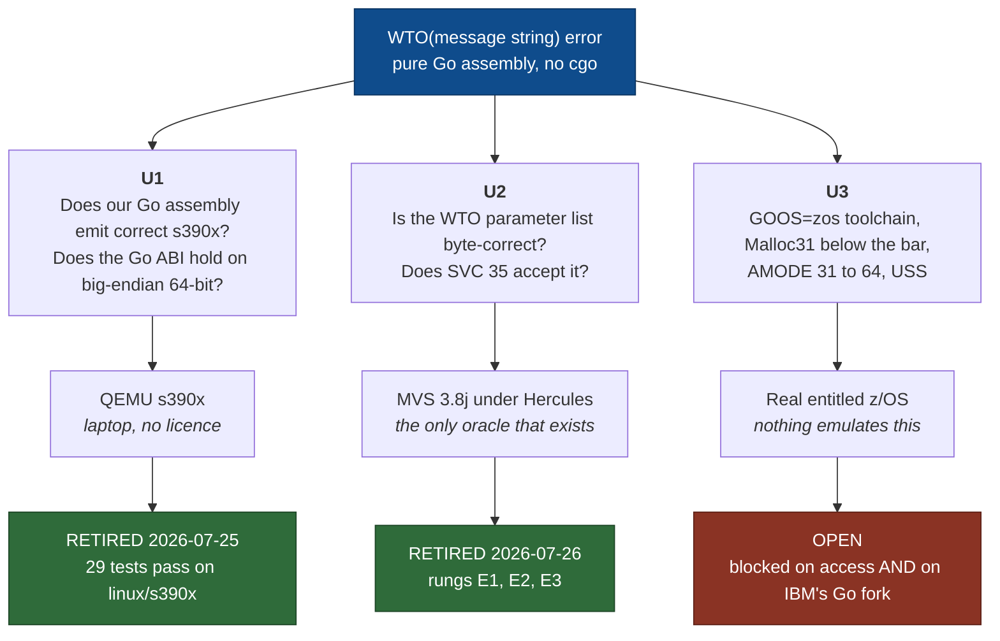
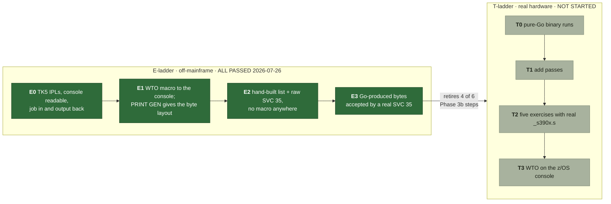
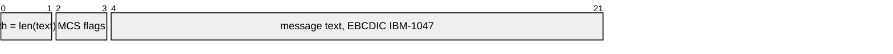
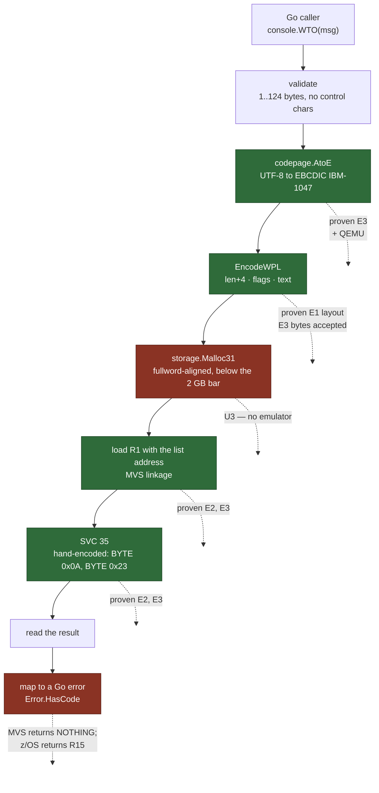
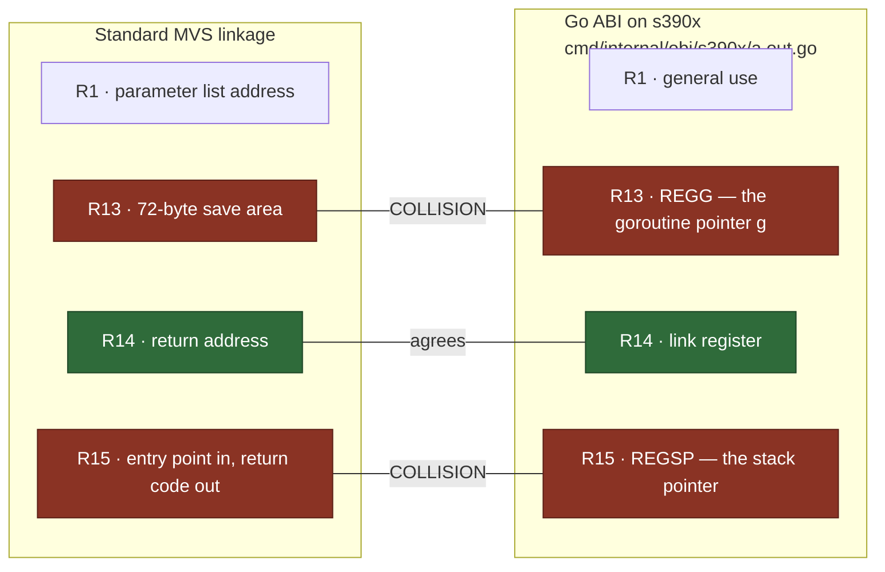
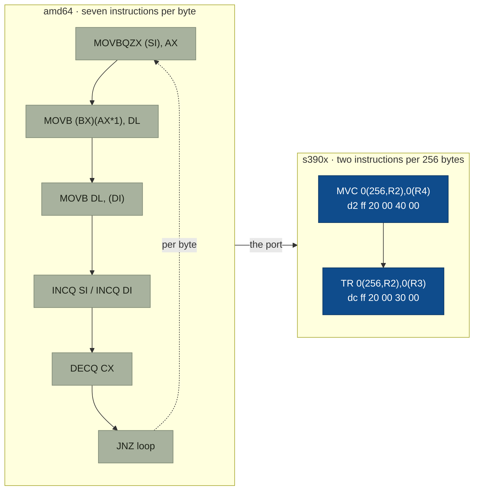
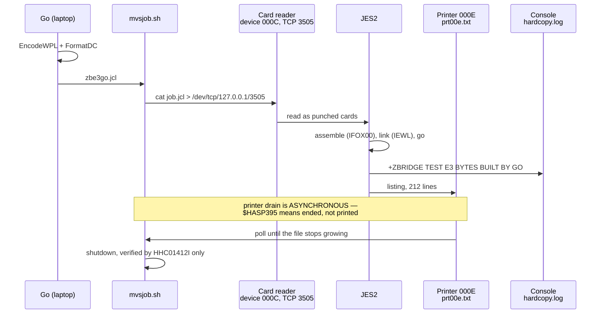

# Diagrams · the WTO call path, the unknowns, and the ladders

Diagrams-as-code, version-controlled next to the evidence they explain. The interactive
companion is [`docs/interactive/wto-explainer.html`](../interactive/wto-explainer.html),
which carries the clickable byte layout and the self-test questions.

Every value in these diagrams came off a real system. Provenance:
`docs/evidence/E1-E3-wto-layout-and-svc35-2026-07-26.md` (MVS 3.8j, TK5 Update 5,
Hercules 4.9.1.0-SDL) and `docs/evidence/E-L-s390x-port-qemu-2026-07-25.md`
(linux/s390x under QEMU 10.2.1). **None of it is a z/OS result.**

---

## 1. The three unknowns

The decomposition that turned "we have no mainframe" into a work plan. Knowing which
unknown a piece of work retires is the difference between progress and motion.



**The point to make out loud:** two of the three unknowns fell without a mainframe. U3 is
the only one that needs hardware, and it splits further — a licence gets you a system, but
it does not get you a compiler.

---

## 2. The ladders

The E-ladder runs off-mainframe and precedes the T-ladder, because mainframe time is the
project's scarcest resource. Every rung produces committed evidence.



---

## 3. The WTO parameter list

Read out of the IFOX00 expansion of `WTO 'ZBRIDGE TEST HELLO',MF=L`. The layout is not
documented in prose in any IBM manual — the assembler listing **is** the primary source.



Real bytes, minimal form (22 bytes):

```
00 16 | 00 00 | E9 C2 D9 C9 C4 C7 C5 40 E3 C5 E2 E3 40 C8 C5 D3 D3 D6
 len  | flags | Z  B  R  I  D  G  E  ␣  T  E  S  T  ␣  H  E  L  L  O
```

**Why `+4`, stated so it can be defended:** the field counts its own two bytes, plus the
two flag bytes, plus the text. It is a length of *header plus text*, not of text.
Confirmed at two lengths — 18 chars gave `0x0016` (22), 38 chars gave `0x002A` (42).

### The routed form, and the trap in it

```
00 16 | 80 00 | ...18 text bytes... | 02 00 | 00 20
 len  | flags |                     | desc  | route
  ↑        ↑
  |        └─ bit 0 set: descriptor and routing halfwords follow the text
  └────────── STILL 22, even though the list is now 26 bytes
```

The length field never covers the descriptor and routing halfwords. An implementation
assuming "length = whole parameter list" looks correct until someone passes a routing
code. This is why `zbridge/console` refuses `WithRoute`/`WithDescriptor` rather than
guessing: brief 003 Q3 found no citable table for the other fifteen MCS bits.

---

## 4. The call path, and where each piece was proven



Two steps remain open, and for different reasons. `Malloc31` is U3 — no emulator reaches
below-the-bar allocation or AMODE switching. Reading a return code is open because of a
**documented divergence**: MVS 3.8j issues none for a single-line WTO (R1 carries the
message ID instead), while z/OS returns one in R15.

---

## 5. The register collision

The single most dangerous detail in the project. Two calling conventions want the same
two registers for different things.



Clobber R13 and the Go runtime cannot find the current goroutine. Clobber R15 and there
is no stack. The `regs/` exercise exists to make both observable from a Go test — and its
s390x tests prove R13 really holds `g` by showing that eight goroutines read eight
distinct values.

---

## 6. Why s390x, in one comparison



Two corrections to make before anyone makes them for you:

1. **`TR` translates in place**, so a two-buffer API costs `MVC` then `TR` — two block
   instructions, not the single instruction the roadmap describes. The per-byte loop is
   genuinely gone; "one instruction" is not literally true.
2. **Go's s390x assembler has no `TR` mnemonic** — 729 mnemonics and the translate family
   is absent — so those six bytes are hand-encoded and then verified by disassembling
   them with GNU `objdump`, which does know the instruction.

And the consequence that matters most: **there is no `SVC` mnemonic either**, so
`SVC 35` will be hand-encoded the same way — `BYTE $0x0A; BYTE $0x23`. The precedent is
inside the Go distribution itself: `x/sys/unix/asm_zos_s390x.s` encodes `SVC 08` as
`BYTE $0x0A; BYTE $0x08`.

---

## 7. How a job reaches MVS, headlessly

No 3270 terminal, no operator. This is what makes rungs reproducible rather than
anecdotal.



The last note is a rule, not a caution: `HHC01412I Hercules terminated` is the only
accepted proof of a clean stop. Process absence proves nothing — it is equally consistent
with a kill mid-write, which is how three sets of DASD volumes were made untrustworthy on
2026-07-26.
